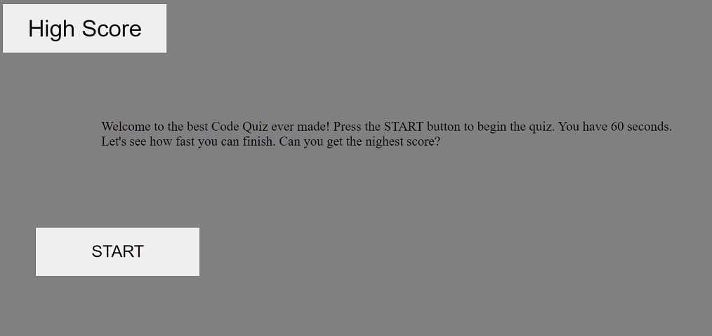
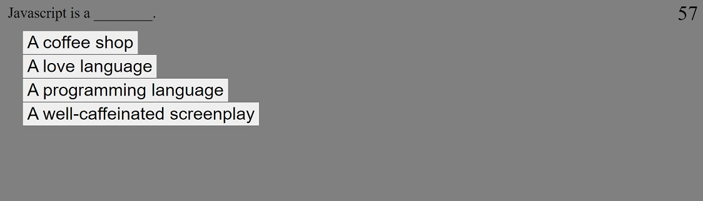
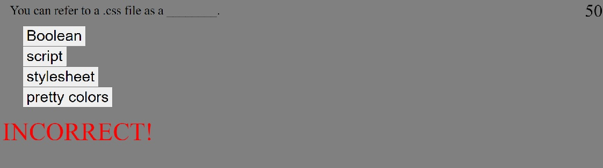
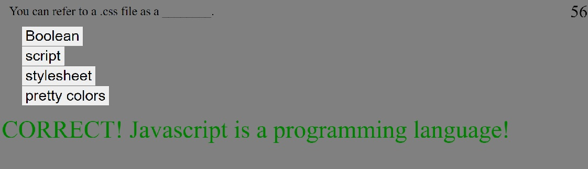

# 04-Homework-CodeQuiz

## Description

I made a Code Quiz application.

On the starting page, there are two buttons: the "START" button and the "High Score" button.

The high score button will display the scores that were saved previously from user's participation in the quiz. The scores and initials are saved in the browser's local storage. There is a button while in the High Score page that says, "Back to Quiz". That button will return the user back to the starting page.

The "START" button starts the quiz. When pressed, a timer will start and the user will be presented with the first question and four answer choices buttons. The timer starts at 60 and acts also as the user's score. Thw goal of the quiz is to get as many correct as possible and as quick as possible. When the user clicks an answer button, the user will be presented with a new question as well as new answer buttons. If the user selects a wrong answer they five seconds will be subtracted from the timer. The quiz will let the user know if their selection was correct or incorrect.

On the fifth question, when the user selects a questions, the quiz will let the user know whether they got the answer correct or not. The quiz will also let the user know their score(time left). Then, the user will have the option to save their high score along with their initials. Once their initials have been submitted, the initials and score will be saved into the local storage and the user will be taken to the high scores page. At the high scores page, user is able to click the "Back to Quiz" button to try the quiz all over again.

If the user runs out of time, the question and answers will disappear. The quiz lets the user know their score is 0. There will be a button that takes the user to the starting page, so the user can try again.

## Screenshots

## Links

GitHub Repository: [https://github.com/jhur628/04-Homework-CodeQuiz](https://github.com/jhur628/04-Homework-CodeQuiz)

Deployed Application: [https://jhur628.github.io/04-Homework-CodeQuiz/](https://jhur628.github.io/04-Homework-CodeQuiz/)

## Other Comments

I have a lot I want to say about this assignment, but I don't feel like writing an essay. Instead, I'll just say a few things.

First, again, a lot of credit to my peers. We talked through a lot of problems together, and I feel they've helped me out a lot.

Second, my code is messy. I am well aware of that. I'm working on it, but the good news is that the application is functional. When presented with my code, my peers were somewhat confused by the way I did things. I understand that the way I coded was not the most efficient way to code, but I just tried my best to follow my own pseudo code. I'm glad it worked out.

Third, I had a good time with this assignment. It took me almost 30 hours, but those hours went by pretty quickly. It was challenging, but I learned so much about javascript. I also learned not to panic, and just work.

Enjoy!